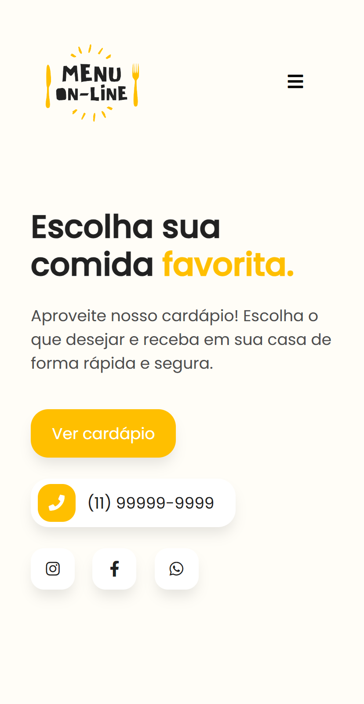
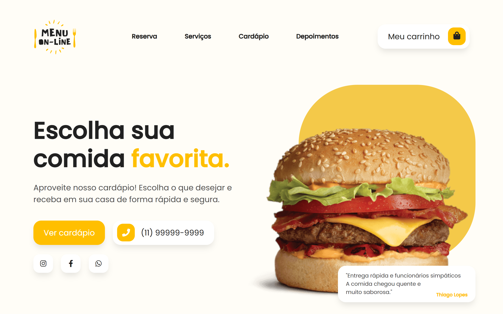

<h1 align="center"> Menu Online </h1>

Online Menu is an online menu project in which the customer assembles his order on a website and sends the information to the establishment via WhatsApp.  

  <a href="#live">Live</a>&nbsp;&nbsp;&nbsp;|&nbsp;&nbsp;&nbsp;
  <a href="#technologies">Technologies</a>&nbsp;&nbsp;&nbsp;|&nbsp;&nbsp;&nbsp;
  <a href="#layout">Layout</a>&nbsp;&nbsp;&nbsp;|&nbsp;&nbsp;&nbsp;
  <a href="#challenges">Challenges</a>&nbsp;&nbsp;&nbsp;|&nbsp;&nbsp;&nbsp;
  <a href="#license">License</a>

  

 

<table>
  <tbody>
    <tr>
      <td>
        
      </td>
      <td>
        
      </td>
    </tr>
  </tbody>
</table>

<h2 id="live">👁️‍🗨️ Live</h2>

This project is hosted at Github Pages of this repository by the link <a href="https://leonardojacomussi.github.io/menu-online-wpp" target="_blank">https://leonardojacomussi.github.io/menu-online-wpp</a>

<h2 id="technologies">🚀 Technologies</h2>

This project was developed with the following technologies:

- HTML and CSS
- Git and Github
- Javascript
- jQuery
- Animate.css
- wow.js
- Via CEP API
- WhatsApp API
